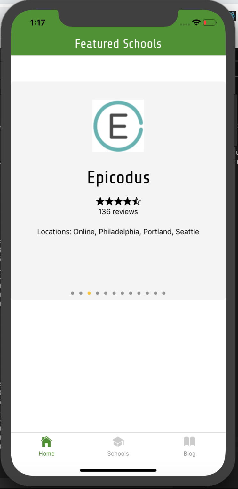
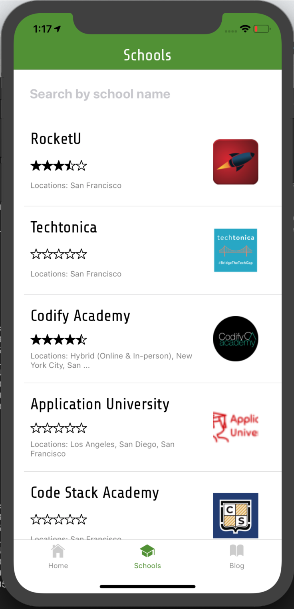
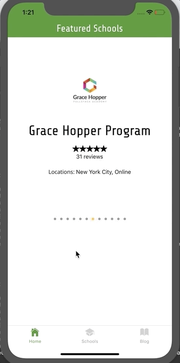

Production site at : https://www.coursereport.com/

</a>

# Course Report - Mobile Application

> Course Report is a site that helps users choose a coding bootcamp to attend.  My team and I were tasked with creating a mobile app that featured a lot of the production site's main features. However, Course Report did not want me to share any code from my repo, so screenshots below are provided instead.

---

## Features

- Home Screen - The home screen showcased the featured schools that paid Course Report for prominence.  We decided the simplest and asthetic way to present this was in a carousel that rotated schools every couple of seconds.

- Blog Screen - When thinking about uses for a mobile app, users tend to use applications that have a constant stream of new information.  We decided to include the blog posts by Course Report, as it would keep users checking back for any fresh updates. Additionally, a user can search for previous posted blog posts.

- Schools Screen - The main function of Course Report is to help users research schools.  The schools screen obtains the user's geolocation and displays the closest schools (by city).  Additionally, when each school is accessed, more information can be brought up including a description, contact button (if a contact is available) and reviews for the school

---

## Technologies Used

React Native - https://facebook.github.io/react-native/
Native Base - https://nativebase.io/
Redis - https://redis.io/
Expess - https://expressjs.com/

---

## Team

| <a href="https://github.com/PrismaPhonic" target="_blank">**Peter Farr**</a>
| <a href="https://github.com/PrismaPhonic" target="_blank">`github.com/PrismaPhonic`</a> | 

| <a href="https://github.com/hineshamin" target="_blank">**Hinesh Amin**</a>
| <a href="https://github.com/hineshamin" target="_blank">`github.com/hineshamin`</a> | 

| <a href="https://github.com/silasburger" target="_blank">**Silas Burger**</a>
| <a href="https://github.com/silasburger" target="_blank">`github.com/silasburger`</a> | 

| <a href="https://github.com/viveksainanee" target="_blank">**Vivek Sainanee**</a>
| <a href="https://github.com/viveksainanee" target="_blank">`github.com/viveksainanee`</a> | 

| <a href="https://github.com/kaedub" target="_blank">**Kevin Welch**</a>
| <a href="https://github.com/kaedub" target="_blank">`github.com/kaedub`</a> | 
